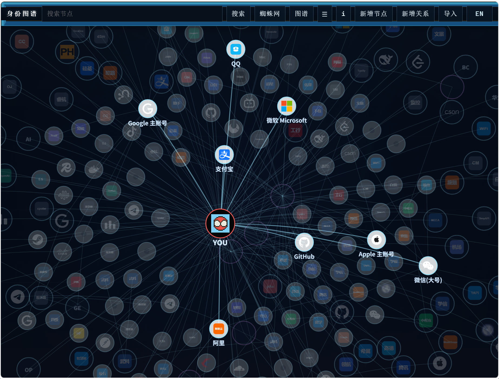
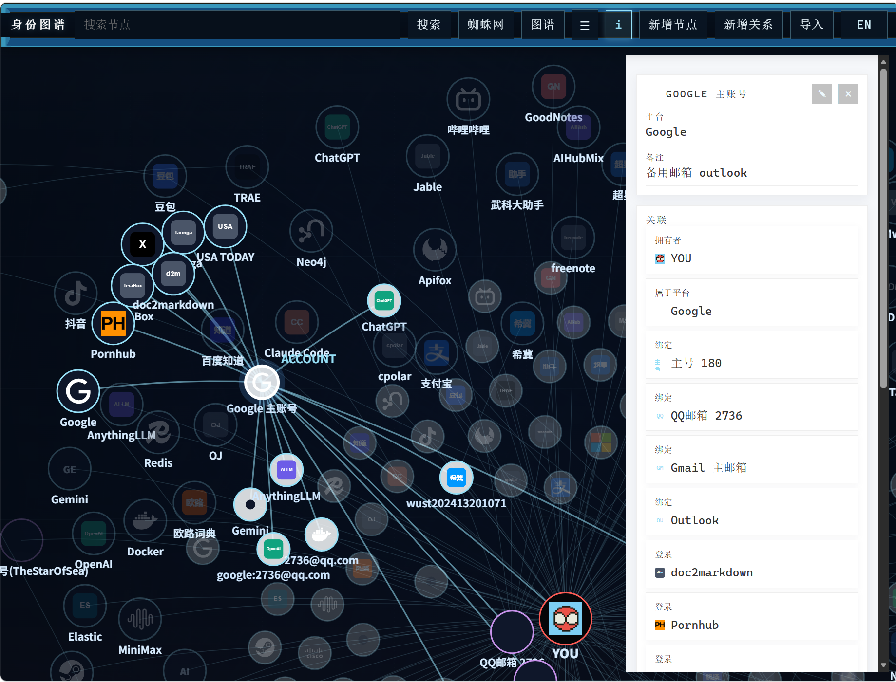
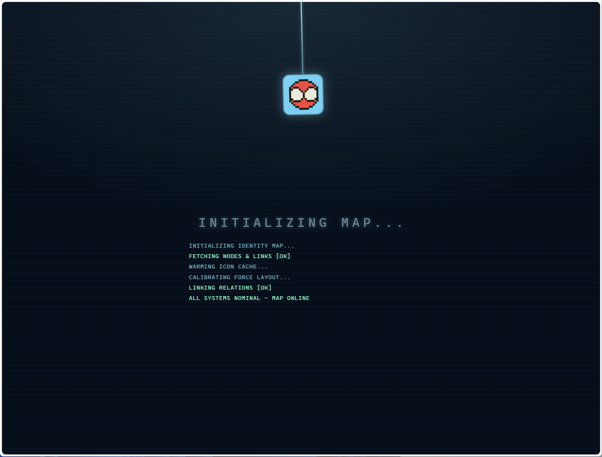

# 身份织网 / Identity Loom

手机号越办越多，账号散落在几十个平台：哪个小号绑了哪张卡？哪台旧手机、甚至借出去的设备还在登录？主号、小号、第三方登录、实名认证……缠成一团死结。等你想注销账号、换绑登录方式或排查安全风险时，根本无从下手。

**Identity Loom** 把这些散落的身份织成一张图：以 `YOU` 为中心，账号、平台、登录方式和绑定关系一目了然。完全本地优先，数据永远不会离开你自己的机器。

---

Phone numbers pile up and accounts sprawl across dozens of platforms. Which alt account is bound to which SIM? Which old phone — or a device you lent someone — is still logged in? Main accounts, alts, third-party sign-ins, real-name verifications... they tangle into a knot. By the time you want to close an account, rebind a login, or audit your own security, there is nowhere to begin.

**Identity Loom** weaves these scattered identities into a single map: with `YOU` at the center, every account, platform, login method, and binding relationship is visible at a glance. Fully local-first — your data never leaves your machine.

## 页面展示 / Screenshots

### 关系图谱总览 / Graph overview

围绕 `YOU` 核心节点的主视图，平台、账号与绑定关系以可交互的力导向图谱呈现，点击节点可平滑移动到中心。
The core view around the `YOU` node — platforms, accounts, and binding relationships laid out as an interactive force graph. Click a node to smoothly center it.



### 节点详情与内联编辑 / Node detail & inline editing

右侧白色详情面板展示节点的全部字段，点击 ✎ 即可在面板内直接编辑，无需单独弹窗；右键节点可进行编辑 / 删除。
The white detail panel on the right shows every field of a node. Click ✎ to edit directly inside the panel — no separate dialog; right-click a node for edit / delete actions.



### 有趣的启动页 / Fun startup screen

进入图谱前，一个好玩的蜘蛛网主题启动页先把氛围拉满。
A playful spider-web themed boot screen sets the mood before the graph appears.



## 技术栈 / Stack

- 前端 / Frontend: React + D3.js
- 后端 / Backend: FastAPI
- 存储 / Storage: Neo4j
- 运行方式 / Runtime: Docker Compose

## 功能 / What it does

- 记录同一平台下的多个账号 / Record many accounts per platform
- 围绕 `YOU` 展示关系图 / Show relationship graph around `YOU`
- 支持手动录入、JSON 导入和 CSV 导入 / Support manual entry, JSON import, and CSV import
- 私有数据不进入 git / Keep private data out of git

## 隐私 / Privacy

真实账号数据放在 `data/private/` 下，并且已被 git 忽略。  
Real account data lives under `data/private/` and is ignored by git.

## 运行 / Run

```bash
docker compose up --build
```

然后打开 / Then open:

- 前端 / Frontend: http://localhost:5173
- 接口 / API: http://localhost:8000
- Neo4j 页面 / Neo4j UI: http://localhost:7474

## CSV 导入 / CSV import

使用带有 `record_type` 列的合并 CSV 文件。  
Use a combined CSV with a `record_type` column.

```csv
record_type,id,kind,name,source,target,relation_type,label,phone,email,username
node,you,you,YOU,,,,,,,
node,google,provider,Google,,,,,,,
relationship,rel_1,,,,you,google,owns,owns,,,
```
